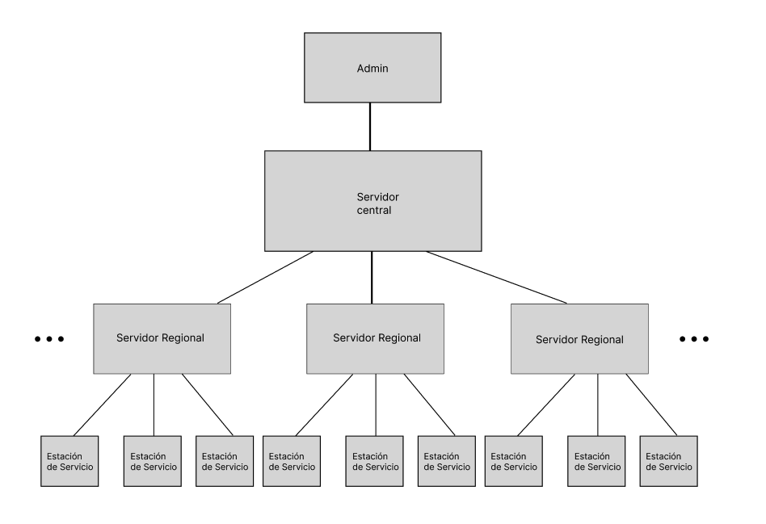
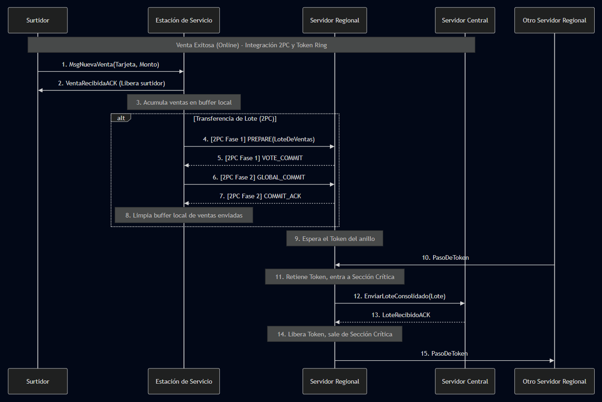
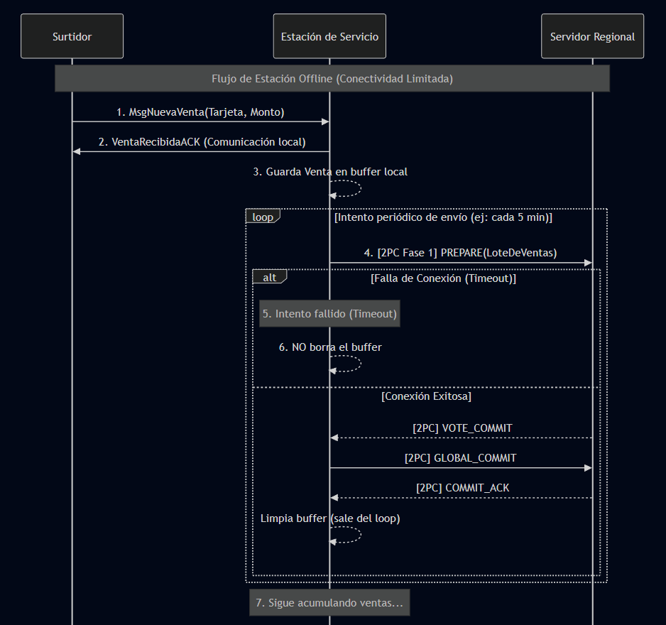
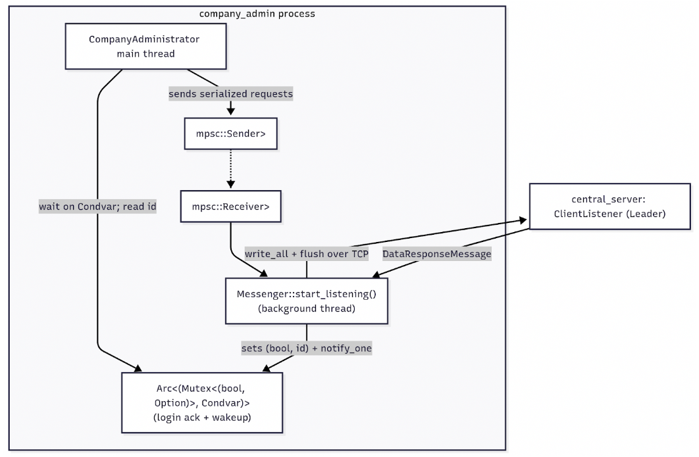
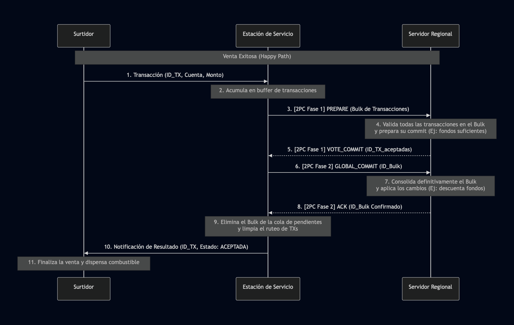
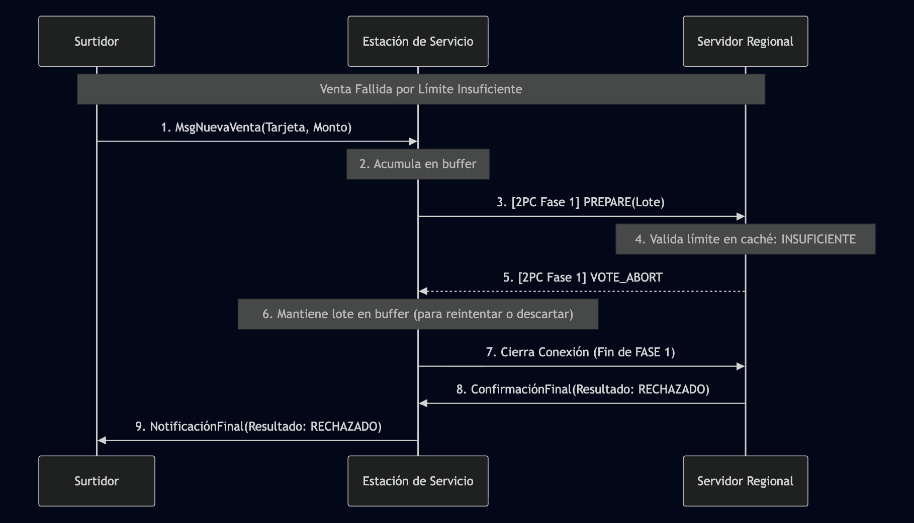

# Trabajo Práctico Grupal - YPF Ruta 

# Primera Entrega

- **Periodo**: 2C - 2025  
- **Corrector**: Darius  
- **Grupo**: another1bitestherust  
- **Integrantes**:

| Alumno | Padrón | Mail | 
|---|---|---|
| Lara Converso | 107632 | lconverso@fi.uba.ar |  
| Hernan de San Vicente | 108800 | hdesanvicente@fi.uba.ar |  
| Edgar Matías Campillay | 106691 | ecampillay@fi.uba.ar |  
| Lucas Villarrubia | 108230 | lvillarrubia@fi.uba.ar |

## Introducción y objetivos

En el presente trabajo presentamos una propuesta preliminar de resolución para el problema de implementación de la tarjeta YPF Ruta.  
El mismo consiste en modelar la emisión y el uso de las tarjetas a través de 1600 estaciones de servicio distribuidas a lo largo de todo el país.  
El modelo se basa en una arquitectura de tres capas con servidores que gestionan las 1600 estaciones, permitiendo que el tráfico se centralice. La estructura es clave para la conectividad limitada, permite que una estación acumule ventas para operar offline.

## Hipótesis

* La sumatoria del valor del límite de las tarjetas con capacidad restringida, no supera el límite total de cuenta de la empresa.  
* Para los casos en donde una estación de servicio se quede sin conexión y la tarjeta no tiene límite y la cuenta si, la transacción se aprueba comprobando los datos que quedaron guardados en la caché hasta el último momento con conexión.   
* Todos los mensajes UDP llegan a destino.   
* Todo servicio que pierde conexión, eventualmente vuelve a conectarse.   
* Los límites de la tarjeta solo se pueden setear a principio de mes.  
* Las ventas sin conexión utilizan como límite el último dato conocido por la estación de servicio y la tarjeta YPF Ruta.

## Diseño y Decisiones de implementación

Elegimos una arquitectura jerárquica de tres capas: servidor central, servidor regional y estación de servicio (que localmente está conectada con los surtidores). Esta estructura localiza la mayoría del tráfico transaccional a nivel regional. Decidimos la distribución de los servidores regionales como uno por provincia y jurisdicciones, lo que nos quedan 25 servidores regionales que cada uno está conectado a 64 estaciones de servicio.  
Distribuimos los datos del servidor central en los servidores regionales, para alivianar la carga del servidor central. Las tarjetas tienen una referencia al servidor de origen donde fueron creadas y allí son almacenadas.

### Propuestas de herramientas de concurrencia distribuida

- Two-Phase-Commit: Entre ``Estación de Servicio`` y ``Servidor Regional``. La transacción a coordinar es ‘Transferir un paquete de Ventas’. Evitaría posibles datos duplicados o pérdida de datos. La ``Estación de Servicio`` inicia la transacción y hasta no recibir confirmación efectiva de parte del servidor, no envía el commit global. Mientras el trabajo recibido no tiene garantía de commit, figura como “pendiente” en el buffer del servidor.  
- Pasaje de Token: Entre ``Servidor Central`` y ``Servidor Regional``. Nos aseguramos que no se esté realizando una venta redirigida desde el servidor central y al mismo tiempo una venta del flujo común (Estación de servicio → servidor regional). La sección crítica, el “derecho” a mandar un paquete de Ventas al regional (el token), debería ser retenido hasta completar la venta.

## Actores

### Servidor central:

**Responsabilidades:**

- Gestiona los saldos de las cuentas de cada empresa, setea los límites y realiza la facturación.  
- Responde las consultas de las empresas para consultar datos.  
- Redirecciona las ventas que no hayan caído en el SV regional correspondiente.

**Estado interno:**

```rust  
struct CentralServer{  
    accounts: HashMap<IdCuenta, Cuenta>,  
    regional_svs: HashMap<Code, TcpStream> // Solo se usa cuando una venta no pudo ser procesada por el SV regional donde se originó. Usar los streams para mandar actualizaciones esporádicas cuando hay un error MOVED.  
}  
```

**Mensajes que recibe:** 

```rust  
/// Mensaje enviado por la empresa para solicitar o modificar datos de su cuenta a YPF.  
struct QueryMessage {  
    flag: u8, // 0, retrieve account data; 1, setear algún parámetro.  
    account_id: u64,  
    card_id: u64, // si card_id = 0, seteo límite total cuenta  
    new_limit: f64,  
}  
```

```rust  
/// Mensaje enviado por la empresa para solicitar o modificar datos de su cuenta a YPF.  
struct MovedError {  
    account_id: u64, // De acá se sacaría el código de origen para ir al SV regional correcto.  
    transaction_id: u64, // De acá sacaría el código donde se originó la transacción (para dar rta).  
    amount: f64,  
    date: u64,  
}  
```

```rust  
/// Mensaje enviado desde el SVR que procesó una transacción con otro SVR de origen.  
/// Este mensaje se procesa y se envía como un mensaje de resultado común a  
/// el servidor de origen para continuar el camino normalmente hasta la ES.  
struct MovedConfirmation {  
    reg_code: Code,  
    intermediate_port: u64, // Puerto de la ES  
    dst_port: u64, // Puerto del Surtidor destino  
    dst_ip: String, // IP de la ES  
    transaction_id: u64,  
    result: u8,  
}  
```  

**Mensajes que envía:**

```rust  
/// Mensaje enviado como respuesta con los datos de la empresa si el mensaje  
/// fue de tipo query.  
struct ResponseMessage {  
    name: String,  
    account_id: u64,  
    res_len: u64,  
    res: Vec<(u64, u64, f64, f64, f64)>, // [timestamp, card_id, amount, card_limit_remainder, account_limit_remainder].  
}
```

```rust  
/// Mensaje que va hacia el SVR para confirmar que el MOVED error tuvo una resolución.  
struct MovedResponseMessage  {  
    intermediate_port: u64, // Puerto de la ES  
    dst_port: u64, // Puerto del Surtidor destino  
    dst_ip: String, // IP de la ES  
    transaction_id: u64,  
    result: u8,
}  
```

### Servidor regional: 

**Responsabilidades:**

- Empaquetador  
- Cachea/Guarda información de cada empresa por región

**Estado interno:**

```rust  
struct RegionalServer {  
    buffer_ventas: Vec<Transaction>,  
    code_card: Vec<Id_Tarjeta>,    
    cache_cuentas: HashMap<IdCuenta, CuentaCache>,  
}  
```

**Mensajes que recibe:**

```rust  
/// Mensaje que envió la ES para registrar una venta  
struct Transaction  {  
    intermediate_port: u64, // Puerto de la ES  
    dst_port: u64, // Puerto del Surtidor origen  
    dst_ip: String, // IP de la ES  
    transaction_id: u64,  
    amount: f64,  
    account_id: u64,  
    card_id: u64,  
}  
```

**Mensajes que envía:**

```rust  
/// Mensaje de los cambios realizados por las regionales al SV central.  
/// Solo es un mensaje de ida. El flujo no espera respuesta.  
/// El servidor recibe esos cambios y ahí los guarda.  
struct UpdateDatabaseMessage {  
    data: HashMap<IdCuenta, CuentaCache>, // Periódicamente se envían todos los cambios propios al servidor central.  
    date: u64,  
}  
```

```rust  
/// Mensaje que viaja desde el SV regional a la ES, para confirmar  
/// el resultado de la transacción.  
struct RegionalConfimationMessage {  
    intermediate_port: u64, // Son los datos de la ES  
    dst_port: u64, // Son los datos del surtidor  
    dst_ip: String, // Surtidor y ES comparten misma IP (conexión surtidor/ES es localhost)  
    transaction_id: u64, // El id que creó el surtidor previamente  
    result: u8,  
    new_limit: f64,  
}  
```

### Estación de servicio

**Responsabilidades**

- Empaquetador, junta los mensajes de los surtidores y los envía según tiempo o cantidad recibida. Tenemos un hilo que escucha un socket UDP en donde los surtidores envían las ventas, las junta hasta llegar al límite o cuando el tiempo se cumple y las manda al servidor regional.  
- Esperar confirmación de la venta para notificar al surtidor el resultado de la misma. Cuando le llega una confirmación desde el SV regional analiza el puerto de destino y lo manda al surtidor indicado.

**Estado interno:**

```rust  
struct Station{  
    buffer: Vec<[u64; MSG_LEN]>, // Se guardan los mesajes a empaquetar.  
    regional_address: IpV4Addr, // SV regional donde voy a mandar las ventas  
}  
```

**Mensajes que recibe:**

```rust  
/// Sale desde el surtidor hasta la estación de servicio.  
struct TransactionMessage {  
    port: u16, //De donde sale la transacción  
    transaction_id: u64, // Id único e incremental por cada venta (propio del surtidor).  
    code: u8, // Código de región que sale de la tarjeta  
    account_id: u64,  
    amount: f64,  
    date: u64,  
}  
```

```rust  
/// Mensaje que viaja desde el SV regional a la ES, para confirmar  
/// el resultado de la transacción.  
struct RegionalConfimationMessage {  
    intermediate_port: u64, // Son los datos de la ES  
    dst_port: u64, // Son los datos del surtidor  
    dst_ip: String, // Surtidor y ES comparten misma IP (conexión surtidor/ES es localhost)  
    transaction_id: u64, // El id que creó el surtidor previamente  
    result: u8,  
}  
```

**Mensajes que envía:**

```rust  
/// Sale desde la ES hacia el SV regional  
struct BulkTransactionMessage {  
    port: u16,  
    ip: String,  
    transactions: [TransactionMessage; MAX_BULK_AMOUNT],  
}  
```

```rust  
/// Mensaje que va desde la ES hacia el surtidor.  
struct TransactionConfirmationMessage {  
    transaction_id: u64,  
    result: u8,  
    new_limit: f64,  
}  
```

### Surtidor:

**Responsabilidades:** 

- Registrar ventas.  
- Validar datos de las tarjetas.

**Estado interno:**

```rust  
struct Pump {  
    local_port: u16,  
    pending_transactions: Queue<[u64, u64, f64]> // Cola para guardar ventas, [timestamp, card_id, amount]  
}  
```

**Mensajes que recibe:**

```rust  
/// Mensaje que va desde la ES hacia el surtidor.  
struct TransactionConfirmationMessage {  
    transaction_id: u64,  
    result: u8,  
    new_limit: f64,  
}  
```

**Mensajes que envía:**

```rust  
/// Sale desde el surtidor hasta la estación de servicio.  
struct TransactionMessage {  
    port: u16, //De donde sale la transacción  
    transaction_id: u64, // Id único e incremental por cada venta (propio del surtidor).  
    code: u8, // Código de región que sale de la tarjeta  
    account_id: u64,  
    amount: f64,  
    date: u64,  
}  
```

### Administrador: 

**Responsabilidades:** 

- Validar la situación actual de la empresa, consultando al servidor central su estado. Interfaz de la empresa cliente con el sistema, se pueden consultar los gastos en tiempo real y el seteo de límites de cuentas y tarjetas.

**Estado interno:**  
```rust  
struct Admin{  
id_account: u64, // ID de la cuenta que se está representando   
	direction: string,  
	port: u16,  
}  
```

**Mensajes que recibe:** 
```rust
struct ResponseMessage {
    name: String,
    account_id: u64,
    res_len: u64,
    res: Vec<[u64, u64, f64, f64, f64]> // [timestamp, card_id, amount, card_limit_remainder, account_limit_remainder].
}
```

**Mensajes que envía:**
```rust
/// Lo envía hacia el servidor central 
struct StatusQueryMessage{
	id_account: u64,
}
```

```rust
/// Lo envía hacia el servidor central 
struct LimitSetMessage{
	id_account: u64,
	new_limit: u64,
}
```

## Estructuras: 

### Tarjeta Ruta: 

```rust
struct Card{
    id_card: u64,
    id_account: u64,
    limit: u64,
} 
```

### Transacción:

```rust
struct Transaction{
    id_transaction: u64,
}
```

### Message

Estructura auxiliar para las clases empaquetadoras, útil para transportar una cantidad máxima de TYPE_MSG_LENGTH mensajes por envío.

```rust
struct Message {
    message_type: u8,
    payload_led: u64,
    payload: [u64, TYPE_MSG_LENGTH],
}
```

## Diagrama



## Protocolo

Para manejar el envío de mensajes entre los componentes del sistema:

- Envío de ventas, como el sistema basa casi la totalidad de su funcionamiento en envío y recepción de confirmaciones de ventas, para evitar una malgasto de recursos utilizaremos UDP. Eso incluye su uso en:
  - Conexión surtidor ⇆ estación de servicio (ida y vuelta).
  - Envíos de actualización de base de datos al servidor central.
- Envío de paquete regionales, TCP:
  - Estación de servicio → Servidor regional. La razón es que al tratarse de ventas tanto el orden como la confiabilidad del envío.
  - Servidor regional → Servidor central en caso de error MOVED. Nuevamente la razón es saber el resultado o si hay que esperar.
  - Administrador ⇆ Servidor central. Como las consultas y/o modificaciones son esporádicas no hay desperdicio de recursos en abrir conexiones y se asegura la recepción de la información por ambas partes.
- Envío de mensajes a través de la red, para apoyarnos en el proceso de serialización definimos la estructura auxiliar message que define en sus primer byte que tipo de mensaje se transmite, para poder así deserializar fácilmente.

## Casos de interés

### Casos felices

#### Venta OK

Con respecto a las capas de nodos, están involucrados
- Surtidor
- Estación
- Servidor Regional

El Surtidor envía la venta a la Estación, que la acumula localmente. Por otro lado, periódicamente, la Estación inicia un commit de dos fases para transferir su batch de ventas de forma atómica al Servidor Regional. Una vez que el Servidor Regional posee el batch, espera recibir el token. Al obtenerlo, entra en su sección crítica, envía el batch al Servidor Central y pasa el token al siguiente servidor cuando recibe confirmación.
La sección crítica aparece cuando se avisa al servidor regional desde el central la realización de una venta y simultáneamente se está procesando una venta con la misma tarjeta en ese servidor regional pero a través del flujo normal (Surtidor → Estación de servicio → Servidor central).

He aquí un diagrama de secuencia con el flujo de los datos y los actores:



#### Consulta de Administrador OK

Consiste en una consulta en tiempo real entre Administrador y Servidor Central. El Administrador envía un QueryMessage al Central solicitando el estado de cuenta de su empresa. El Central accede a su estado interno y responde con la información con un ResponseMessage.
Para este caso, ningún estado interno se modifica, al ser una operación read-only.

#### Modificación de límites

Operación de escritura desde un Administrador hacia el Servidor Central. Con un QueryMessage establece un límite de gasto para una cuenta o una tarjeta. El Central se ocupa de propagar este cambio a los Servidores Regionales para actualizar copias locales.
En este flujo, se modifica el estado interno del Servidor Central y el caché de los Regionales.

### Casos de Conectividad Limitada

#### Sin conexión al servidor regional

Como principal caso de conectividad limitada, involucra a los nodos
- Estación
- Servidor Regional

La Estación funciona perfectamente, recibe ventas de sus Surtidores y las acumula en su buffer. Cuando intenta hacer el commit con el Servidor Regional para enviar su batch, la conexión falla (por timeout). El diseño asegura que la Estación simplemente intentará el commit más tarde, sin rechazar nuevas ventas.
El estado interno clave que cambiaría es el buffer de la Estación, no se vaciará, sino que seguirá creciendo y acumulando ventas hasta que la conexión con el Servidor Regional se restablezca.

He aquí otro diagrama de flujo con un intento de commit que queda “en loop”:



# Entrega Final

- **Fecha**: 25/11/2025


## Implementaciones 

### Pump-Surtidor
El Surtidor es el punto de interacción inicial. Su función principal es simular la venta de combustible, generar la transacción digital con todos los detalles de la venta (monto, cuenta, ID) y enviarla a la Estación de Servicio para su procesamiento y validación. También espera una respuesta de confirmación o rechazo para finalizar la operación con el cliente.

[Más Detalles](pump/README.md)

### Estación de Servicio
La Estación de Servicio actúa como el Coordinador central. Recibe las transacciones de múltiples Surtidores, las acumula en lotes (bulks) y es responsable de negociar su validación y consolidación final con el Servidor Regional mediante el protocolo de Confirmación en Dos Fases (2PC). Una vez que el Regional confirma la validez del lote, notifica el resultado de vuelta al Surtidor correspondiente.

[Más Detalles](gas_station/README.md)

### Administrador

La implementación final del administrador funciona como una aplicación de consola que responde las queries del usuario una vez que el mismo se encuentra logueado.

Este componente consiste de un actor y una estructura principal.

* Actor Messenger: Es un actor auxiliar que se encarga de la comunicación tanto de entrada como de salida del cliente. Funciona a través de un canal que envía vectores de bytes entre hilos para directamente escribir por socket a la instancia maestro del servidor central.
* Cliente: Es la estructura principal del sistema que actúa como una aplicación de consola. Sus funciones son recibir el input, verificar y parsear los comandos.

Ambos componentes se sincronizan entre el canal de envío de bytes y una variable de condición que avisa al hilo principal cuando se puede volver a enviar otro comando.



#### Comandos

El administrador incluye comandos para:

* Loguearse en una cuenta ya existente.
* Desloguearse para liberar el cliente.
* Registrar una nueva cuenta (funciona como logueo), registra una nueva cuenta en con el código de región asignado al iniciar el cliente.
* Modificar límite de una cuenta (solo si supera la sumatoria de todos los límites de cuenta).
* Modificar el límite de las tarjetas.
* Realizar consultas
  * Información de la cuenta y las tarjetas asociadas.
  * Información de las ventas asociadas a la cuenta.
  * Información de ventas asociadas a las tarjetas asociadas a dicha cuenta.

  Las consultas asociadas a las ventas, pueden ser filtradas por límites de fechas.

Para ver una documentación más detallada sobre los comandos ver (README.md)\[path\] y consultar el comando HELP presente en el sistema.

*Disclaimer:* Ejemplos de ejecución de las queries se encuentran en el README de company\_admin.

#### Protocolo de comunicación con servidor central

##### Envío de paquetes entre el servidor central y el administrador

Para el envío de paquetes se implementaron un conjunto de mensajes para representar las queries.

* Mensaje de registro, RegisterAccountMessage.
* Mensaje de alta de tarjeta, RegisterCardMessage.
* Mensaje de consulta de datos, QueryDataMessage.
* Mensaje de actualización de datos, UpdateDataMessage.
* Mensaje de exploración, PROBE (al ser un mensaje de presentación, es simplemente el código para que el listener del servidor central pueda identificarlo).

Dichos mensajes se encuentran en el módulo compartido shared\_resources.

##### Para la recepción de paquetes provenientes desde el servidor central

Para la recepción de mensajes provenientes del servidor central se implemento un único tipo de mensaje, DataResponseMessage, el cual incluye:

- Código de mensaje al que responde, si bien cada mensaje se envía y procesa secuencialmente, se aprovecha el uso de este código para interpretar los valores posteriores.
- Estado de la operación, 0 para éxito, 1 para fallos.
- Identificador asociado a la cuenta o tarjeta que realizó la operación.
- Piggybacked data, campo opcional, creado para tratar con aquellas respuestas que van más allá de una simple confirmación. Los mensajes de consulta y probing incluyen sus datos en este campo.

### Servidor regional

El Servidor Regional actúa como un “agregador” de transacciones y la decisión de su creación fue para desacoplar el contacto entre el Servidor Central y las Estaciones de Servicio (que implicaban cardinalidades difíciles para manejar concurrentemente). Su diseño prioriza la consistencia de saldos y disponibilidad ante fallos de la red superior.

#### Gestión de Estado Mutable y Concurrencia

Para manejar la concurrencia de múltiples Estaciones de Servicio conectadas simultáneamente vía TCP, se usa un esquema de locks en memoria (en \`[accounts.rs](http://ccounts.rs)\`):

##### Caché (\`RwLock\`)

Se usa un \`RwLock\<HashMap\>\` para almacenar el estado de cuentas (límites y gastos). Esto permite una alta concurrencia de lectura mientras asegura una exclusión mutua estricta solo cuando llegan actualizaciones del Central o se confirman gastos.

##### Transacciones Pendientes (\`Mutex\`)

Para la fase “intermedia” del Two-Phase Commit (entre el PREPARE y el COMMIT), se utiliza un \`Mutex\` separado. Esto reduce la contención de saldo (de la fase 1\) y no bloquea la lectura de otros saldos.

#### Protocolo de Consistencia: Two-Phase Commit

Se implementó el 2PC para garantizar que no se produzcan sobregiros, ni pérdidas de datos, permitiendo que múltiples Estaciones operen sobre la misma cuenta.

##### PREPARE

Al recibir un lote (o bulk), el regional no descuenta el saldo inmediatamente, sino que lo mueve a un estado \`reserved\` en memoria. Si el saldo disponible es suficiente, vota positivo (para el commit).

##### COMMIT

Solo al recibir confirmación final de la Estación (la cual estaría coordinando este 2PC), el saldo pasa de \`reserved\` a \`current\_spending\`.  
Se implementó una respuesta granular: Si un lote tiene 10 ventas, y 1 falla por saldo, el Regional sólo rechaza esa venta y aprueba el resto. Esto significa una reducción de mensajes con respecto a lotes y flujo de ventas exitosas.

#### Tolerancia a Fallos

Mencionando al primer diseño y correcciones a esta entrega final respecto a un Single Point of Failure del Central, el Regional implementa lógica de cliente resiliente:

- Al iniciarse, recibe una lista de direcciones IP correspondientes a las réplicas del Central.
- Utiliza una estrategia Round-Robin (dando “vueltas” al anillo de réplicas) reintentando para reportar bulks consolidados. Si una réplica cae, el Regional intenta conectarse automáticamente a la siguiente disponible sin perder datos een memoria, garantizando la facturación (con una cantidad de réplicas considerable y segura).

#### Persistencia

El servidor opera con el principio de guardar los datos en la memoria RAM para máxima velocidad de respuesta a los surtidores. Se “asume” que la “verdad” persiste en el Servidor Central y en los logs de las Estaciones de Servicio. En caso de reinicio del Regional, su estado se reconstruye con la última “foto” del central.

#### [Más detalles de protocolo](regional_server/README.md)

### Servidor central

#### Relación entre pares

#### Relación SV central \- Cliente

El servidor central escucha en un puerto diferente respecto de la comunicación entre pares. En dicho puerto cada cliente conectado pasa a pertenecer a un nuevo thread en el cual se escucha el stream asociado para aplicar las operaciones enviadas por el cliente.

A su vez el servidor central da uso de este mismo stream para envíar los resultados de las operaciones (ver DataResponseMessage).

Para cuidar las restricciones de consistencia se aplican las operaciones enviadas al nodo líder en cascada en los nodos réplica.

Como mecanismo de robustez, se implementó un tipo de mensaje PROBE que permite al cliente conocer todas las direcciones (ip \+ puertos) de aquellos nodos que sean parte del anillo del líder. Dicha operación enviada en un nodo réplica responde con la dirección del nodo líder. Así en caso de caída del servidor central asociado a uno o más clientes, estos solo deben esperar a que haya un nuevo líder y pueden seguir enviando comandos sin perder funcionalidad alguna.

### Recursos compartidos

Módulo general en donde incluímos:

* Funciones utilizadas en varios componentes del programa.
* Mensajes que viajan entre diferentes procesos.
* Declaraciones de tipos generales.
* Declaraciones de constantes compartidas a lo largo de todo el código.

## Herramientas de concurrencia 

- Two-Phase-Commit: Entre Estación de Servicio y Servidor Regional. 
La transacción a coordinar es ‘Transferir un paquete de Ventas’. Evitaría posibles datos duplicados o pérdida de datos. La Estación de Servicio inicia la transacción y hasta no recibir confirmación efectiva de parte del servidor, no envía el commit global. Mientras el trabajo recibido no tiene garantía de commit, figura como “pendiente” en el buffer del servidor.
Adjuntamos diagramas del caso donde todo sale bien y del caso donde el servidor regional falla en la fase de preparación.
Transacción OK:

Transacción Falla:


- Leader Election (Ring): Para garantizar la disponibilidad continua del Servidor Central y eliminar el punto único de fallo, se implementó una arquitectura de replicación gestionada mediante el Algoritmo de Anillo.
Las réplicas del servidor se organizan en una topología lógica circular, donde cada nodo conoce a su sucesor inmediato. Esta estructura permite un monitoreo ordenado y eficiente del estado del clúster.


